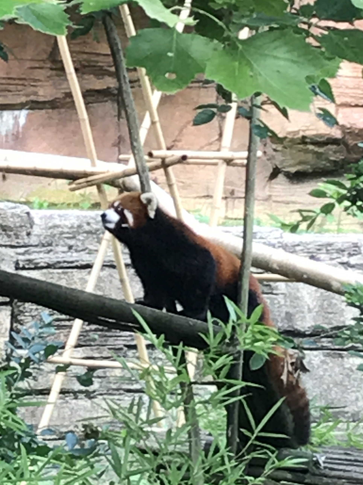
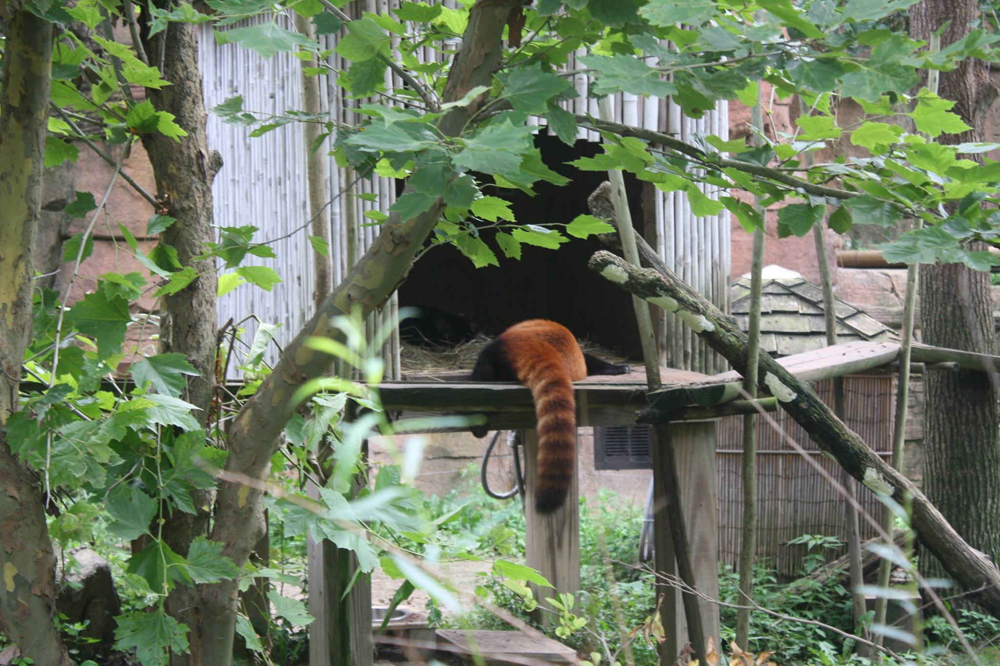


rawr


## Professional

My main interest in Astronomy has been the study of binary stars and multiple stellar systems.  I went to Ohio State University for my undergraduate studies.  There, I worked on two projects, one on the IceCube detector with Dr. Carsten Rott, and the other examining sdB+dM binaries with Dr. Don Terndrup.  These binaries have periods on the order of hours and exhibit a strong reflection effect as the stars are tidally locked.  This work resulted in a poster at the Winter 2015 AAS meeting and a undergraduate thesis.

After graduating from Ohio State in Spring 2015, I joined the graduate program at Georgia State University in the Fall of 2015.  My research has focused on the identification of wide (visual) binary stars in large catalogs using Bayesian analysis with Dr. Sebastien Lepine at Georgia State.  My work first focused on the SUPERBLINK high proper motion catalog but then turned to Gaia DR2 as soon as that became available.  The result of this work is a catalog of roughly 99,000 wide binaries that have a high probability of being gravitationally bound pairs.  

Over the past two years, I have been working with Dr. Gerard van Belle at Lowell Observatory as a predoctoral fellow to observe the wide pairs I have identified with speckle imaging.  The goal is to find unresolved companions in these systems and determine how many triples, quadruples, etc. there are.  This may allow us to constrain the possible formation scenarios for these wide binaries.

Recently, I have also expanded this search to TESS and Kepler light curves, hoping to find eclipsing binaries and fast rotators.  This search has already yielded some interesting results which I am in the process of writing up!

## Personal
I am an avid gamer, whether that means board games, video games or Dungeons and Dragons.  Strategy games are my preferred type of game, with Risk being one of my favorite games.  I run and participate in several DnD games every week, which helps me stay sane.  

Also, red pandas are the best.

