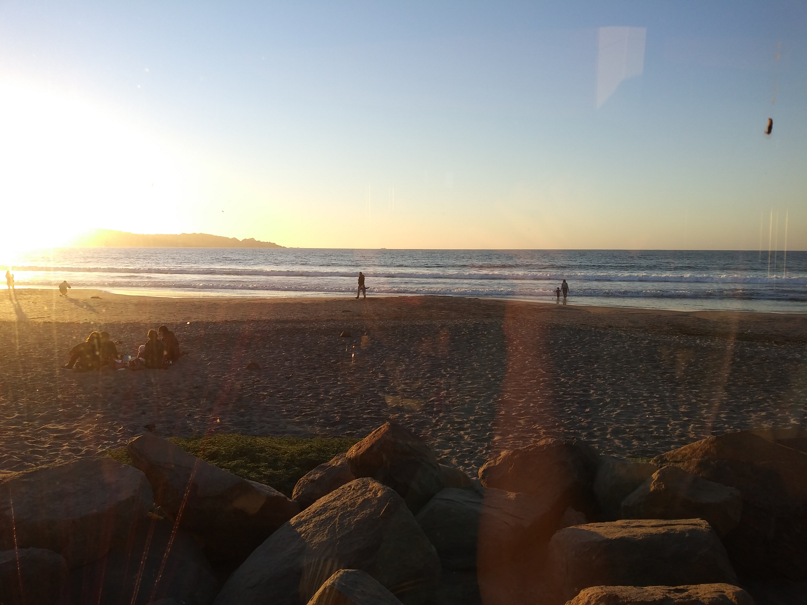
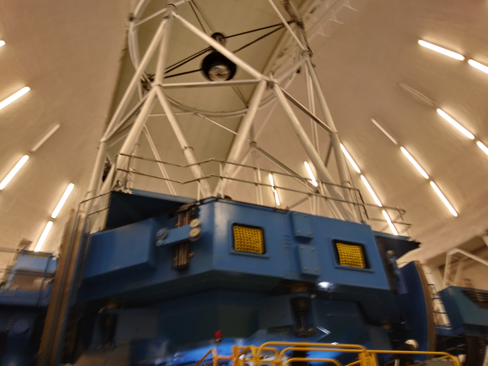
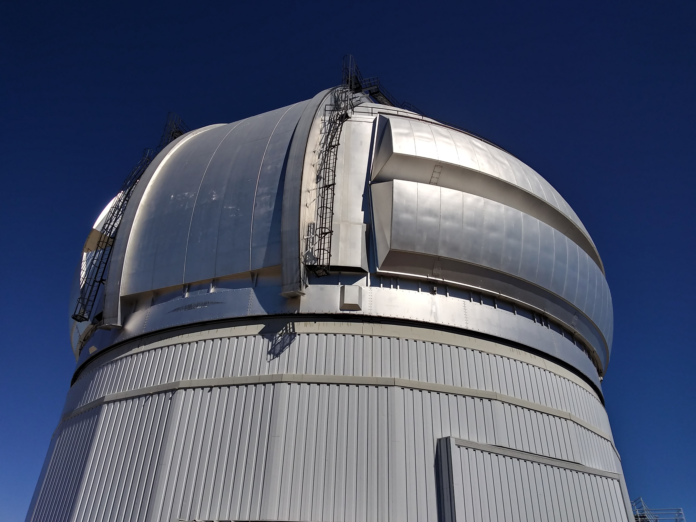
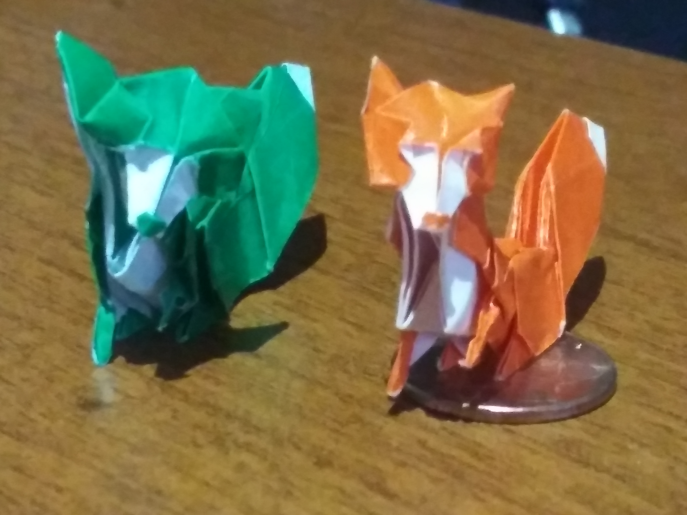

Observing!
-4 nights using QWSSI on Lowell Discovery Telescope
-13 nights using DSSI on Lowell Discovery Telescope (LDT)
-6 nights using DSSI on Gemini South
-13 nights using Zorro on Gemini South
-6 nights using 'Alopeke on Gemini North
-3 nights using HYDRA spectrograph on WIYN 3.5 m
-1/2 night using Deveny spectrograph on LDT
-1/2 night using IGRINS spectrograph on LDT

Here are some pictures from my Observing runs!

The Town of Telc and Prague from the Universe of Binaries Conference



  


